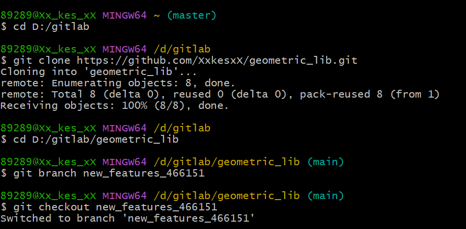
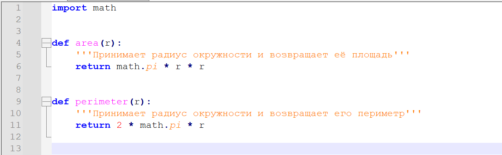
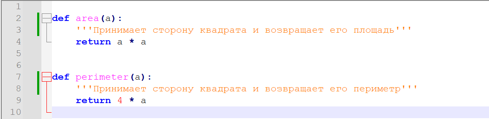
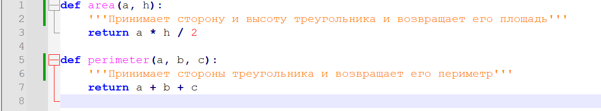
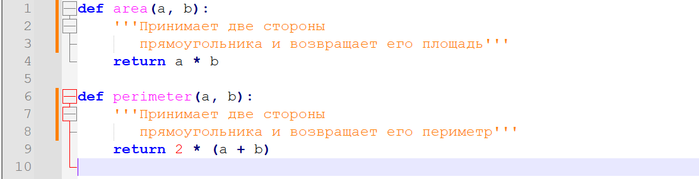
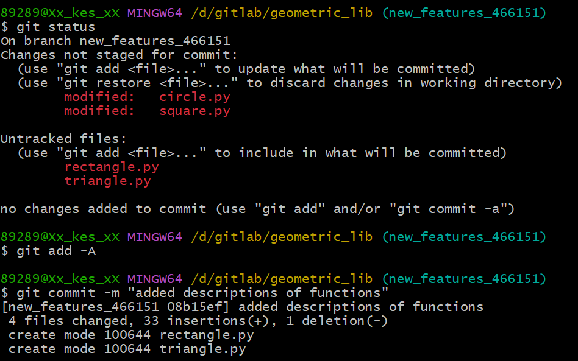

# Описание решения

1.	Клонирование репозитория и создание новой ветки.
    

2.	Добавление описаний для функций.
    
    
    
    

3.	Commit изменений.
    

# Описание функций

## Формулы, на которых основаны функции
### Area
- Circle: S = πR²
- Rectangle: S = ab
- Square: S = a²
- Triangle: S = a * h / 2

### Perimeter
- Circle: P = 2πR
- Rectangle: P = 2a + 2b
- Square: P = 4a
- Triangle: P = a + b + c

## Функции для фигуры Circle(окружность):

Функция ***area*** принимает на вход одно целое либо вещественное положительное число - радиус окружности и возвращает её площадь. Для вызова функции необходимо прописать **area(r)**, где r - радиус окружности. Для примера возьмем r = 3, тогда area(3) вернет значение - 28,26.

Функция ***perimeter*** принимает на вход одно целое либо вещественное положительное число - радиус окружности и возвращает её периметр. Для вызова функции необходимо прописать **perimeter(r)**, где r - радиус окружности. Для примера возьмем r = 2, тогда perimeter(2) вернет значение - 12,56.

## Функции для фигуры Rectangle(прямоугольник):

Функция ***area*** принимает на вход два целых либо вещественных положительных числа - стороны прямоугольника и возвращает его площадь. Для вызова функции необходимо прописать **area(a, b)**, где a, b - стороны прямоугольника. Для примера возьмем a = 2, b = 3, тогда area(2, 3) вернет значение - 6.

Функция ***perimeter*** принимает на вход два целых либо вещественных положительных числа - стороны прямоугольника и возвращает его периметр. Для вызова функции необходимо прописать **perimeter(a, b)**, где a, b - стороны прямоугольника. Для примера возьмем a = 5, b = 6, тогда **perimeter**(5, 6) вернет значение - 22.

## Функции для фигуры Square(квадрат):

Функция ***area*** принимает на вход одно целое либо вещественное положительное число - сторону квадрата и возвращает его площадь. Для вызова функции необходимо прописать **area(a)**, где a - сторона квадрата. Для примера возьмем a = 4, тогда **area(4)** вернет значение - 16.

Функция ***perimeter*** принимает на вход одно целое либо вещественное положительное число - сторону квадрата и возвращает его периметр. Для вызова функции необходимо прописать **perimeter(a)**, где a - сторона квадрата. Для примера возьмем a = 2, тогда **perimeter(2)** вернет значение - 8.

## Функции для фигуры Triangle(треугольник):

Функция ***area*** принимает на два целых либо вещественных положительных числа - сторону и высоту треугольника и возвращает его периметр. Для вызова функции необходимо прописать **area(a, h)**, где a - сторона треугольника, а h - высота треугольника. Для примера возьмем a = 4, h == 2, тогда **area(4, 2)** вернет значение - 4.

Функция ***perimeter*** принимает на вход три целых либо вещественных положительных числа - стороны треугольника и возвращает его периметр. Для вызова функции необходимо прописать **perimeter(a, b, c)**, где a, b, c - стороны треугольника. Для примера возьмем a = 2, b = 3, c = 4, тогда **perimeter(2, 3, 4)** вернет значение - 9.

# Unittest-ы

Тесты написанны с помощью встроенной в python библиотеки **unittest**. Тесты проверяют функции на корректность ответов, а также на наличие обработки исключений, таких как ValueError и TypeError. 

# История изменений
- [d25860432d46e0580306b272047fe9d894547408 Добавлены unittest-ы](https://github.com/KulEDmitr/geometric_lib/commit/d25860432d46e0580306b272047fe9d894547408)
- [78c90f648e5ef31c0d6b8e897be3bc8f1647e51d Изменение файла README](https://github.com/KulEDmitr/geometric_lib/commit/380393b3f4d19a0063f0c6b33850f54ec164479a)
- [babd43a20df7316ae941d069f9716a1e516f653a Изменение функции circle](https://github.com/KulEDmitr/geometric_lib/commit/babd43a20df7316ae941d069f9716a1e516f653a)
- [3003b82e3aed346a2a32efa3a117ce2feeb7f12f Изменение функции rectangle](https://github.com/KulEDmitr/geometric_lib/commit/3003b82e3aed346a2a32efa3a117ce2feeb7f12f)
- [c20be777b00bcda79557b3430524f3bf42c3c123 Изменение функции square](https://github.com/KulEDmitr/geometric_lib/commit/c20be777b00bcda79557b3430524f3bf42c3c123)
- [ef46f50e83fe266c140b5e0637c82fa66a28cba1 Изменение функции triangle](https://github.com/KulEDmitr/geometric_lib/commit/ef46f50e83fe266c140b5e0637c82fa66a28cba1)
