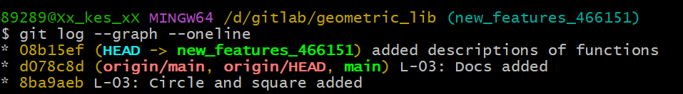

# Описание решения

1.	Клонирование репозитория и создание новой ветки.
    

2.	Добавление описаний для функций.
    
    
    
    

3.	Commit изменений.
    

# Описание функций

## Формулы, на которых основаны функции
### Area
- Circle: S = πR²
- Rectangle: S = ab
- Square: S = a²
- Triangle: S = a * h / 2

### Perimeter
- Circle: P = 2πR
- Rectangle: P = 2a + 2b
- Square: P = 4a
- Triangle: P = a + b + c

## Функции для фигуры Circle(окружность):

Функция ***area*** принимает на вход одно значение - радиус окружности и возвращает её площадь. Для вызова функции необходимо прописать **area(r)**, где r - радиус окружности. Для примера возьмем r = 3, тогда area(3) вернет значение - 28,26.

Функция ***perimeter*** принимает на вход одно значение - радиус окружности и возвращает её периметр. Для вызова функции необходимо прописать **perimeter(r)**, где r - радиус окружности. Для примера возьмем r = 2, тогда perimeter(2) вернет значение - 12,56.

## Функции для фигуры Rectangle(прямоугольник):

Функция ***area*** принимает на вход два значения - стороны прямоугольника и возвращает его площадь. Для вызова функции необходимо прописать **area(a, b)**, где a, b - стороны прямоугольника. Для примера возьмем a = 2, b = 3, тогда area(2, 3) вернет значение - 6.

Функция ***perimeter*** принимает на вход два значения - стороны прямоугольника и возвращает его периметр. Для вызова функции необходимо прописать **perimeter(a, b)**, где a, b - стороны прямоугольника. Для примера возьмем a = 5, b = 6, тогда **perimeter**(5, 6) вернет значение - 22.

## Функции для фигуры Square(квадрат):

Функция ***area*** принимает на вход одно значение - сторону квадрата и возвращает его площадь. Для вызова функции необходимо прописать **area(a)**, где a - сторона квадрата. Для примера возьмем a = 4, тогда **area(4)** вернет значение - 16.

Функция ***perimeter*** принимает на вход одно значение - сторону квадрата и возвращает его периметр. Для вызова функции необходимо прописать **perimeter(a)**, где a - сторона квадрата. Для примера возьмем a = 2, тогда **perimeter(2)** вернет значение - 8.

## Функции для фигуры Triangle(треугольник):

Функция ***area*** принимает на два значения - сторону И высоту треугольника и возвращает его периметр. Для вызова функции необходимо прописать **area(a, h)**, где a - сторона треугольника, а h - высота треугольника. Для примера возьмем a = 4, h == 2, тогда **area(4, 2)** вернет значение - 4.

Функция ***perimeter*** принимает на вход три значения - стороны треугольника и возвращает его периметр. Для вызова функции необходимо прописать **perimeter(a, b, c)**, где a, b, c - стороны треугольника. Для примера возьмем a = 2, b = 3, c = 4, тогда **perimeter(2, 3, 4)** вернет значение - 9.

# История изменений

## 
